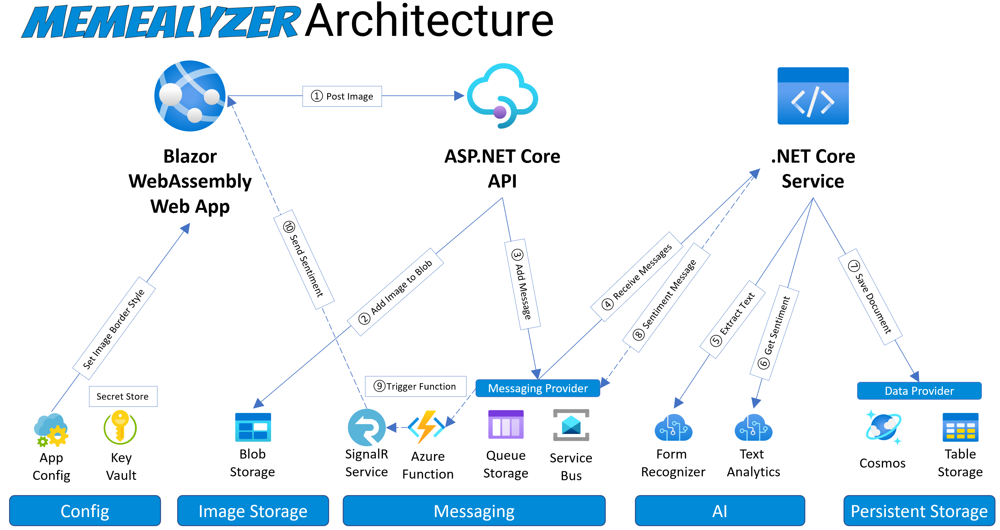

# Memealyzer

## Meme + Analyzer = Memealyzer

Memealyzer determines if a meme's sentiment is positive, negative, or neutral. 

For example, given this meme:


Memealyzer will extract the text, analyize the sentiment of that text, and then change the border color to red for negative sentiment, green for positive, and yellow for neutral.


Memealyzer is an app built to demonstrate some the latest and greatest Azure tech to dev, debug, and deploy microservice applications, including:

- [Azure SDKs](https://aka.ms/azsdk) - to interact Azure services
- [Bicep](https://github.com/azure/bicep) & [Azure CLI](https://aka.ms/getazcli) - to provision Azure resources
- [Project Tye](https://github.com/dotnet/tye/) to dev, debug, and deploy the solution
- [Blazor](https://dotnet.microsoft.com/apps/aspnet/web-apps/blazor) - for a responsive client-side app built with .NET/C#.
- [Azure Functions](https://azure.microsoft.com/services/functions/) - to connect message queues with SignalR
- [Azure SignalR Service](https://azure.microsoft.com/services/signalr-service/) - to send messages to the web app

> Since 12/5/2020, this project will use Bicep and Project Tye instead of Terraform and Docker Compose, so we will **not** keep those files up to date. They will be kept in the project for historical purposes only. More info can be found on the ["Legacy Tools"](docs/LegacyTools.md) page

## Architecture



> This is the current .NET architecture - we are in the process of developing for other languages and architectures as well.

## Azure Resources

The following Azure resources are used in this application:

1. [Resource Group](https://docs.microsoft.com/azure/azure-resource-manager/management/overview#resource-groups)
1. [Storage Account](https://docs.microsoft.com/azure/storage/common/storage-introduction)
1. [Cognitive Services Form Recognizer](https://docs.microsoft.com/azure/cognitive-services/form-recognizer/overview)
1. [Cognitive Services Text Analytics](https://azure.microsoft.com/services/cognitive-services/text-analytics/)
1. [Cosmos DB](https://docs.microsoft.com/azure/cosmos-db/introduction)
1. [Key Vault](https://azure.microsoft.com/services/key-vault/)
1. [Azure Kubernetes Service](https://docs.microsoft.com/azure/aks/)
1. [Application Insights](https://docs.microsoft.com/azure/azure-monitor/app/app-insights-overview)
1. [Azure SignalR Service](https://azure.microsoft.com/services/signalr-service/)
1. [Azure Functions](https://azure.microsoft.com/services/functions/)
1. [Azure Service Bus](https://azure.microsoft.com/services/service-bus/)

> You can select the Data and Messaging Providers via environment variables.  See the ["Environment Variables"](#environment-variables) section below for more information.

## Dev Machine Setup

The following are required to run this application.

1. Terminal - WSL2, Zsh, GitBash, PowerShell, not Windows Command prompt as this application uses bash script files.  
1. [Azure CLI](https://aka.ms/azcliget)
1. [Git](https://git-scm.com/downloads) 
1. [VS Code](https://code.visualstudio.com/)
1. [Docker](https://docs.docker.com/get-docker/)
1. [Kubectl](https://kubernetes.io/docs/tasks/tools/install-kubectl/)
1. [.NET SDK](https://dotnet.microsoft.com/download) - 5.0
1. [Azure Functions Core Tools](https://docs.microsoft.com/azure/azure-functions/functions-run-local) - v3.0.2881 minimum
1. [Project Tye](https://github.com/dotnet/tye/blob/master/docs/getting_started.md)
1. [Bicep](https://github.com/Azure/bicep/blob/main/docs/installing.md)

## Quickstart

> Please note that you will see {BASENAME} throughout this document.  Replace it with any unique text that you'd like, such as memealyzer007.

Here's how to quickly provision and deploy the app:
1. Open a Terminal - The same terminal you used to install the pre-reqs above.
1. Clone Repo
   - `git clone https://github.com/jongio/memealyzer`
1. Make sure you follow the ["Dev Machine Setup"](#dev-machine-setup) steps above.
1. You can open the entire VS Code workspace here
   - `./open.sh` 
   
      or
   
   - Open `/src/net/memealyzer.code-workspace`
1. Login to the Azure CLI and set your subscription
   - `az login` and `az account set -s {SUBSCRIPTION_NAME}`
1. To deploy all required Azure Resources and run locally:
   - `./run.sh {BASENAME}`
1. To deploy all required Azure Resources and run in Azure:
   - `./deploy.sh {BASENAME}`

### Deployment
To only deploy resources:
1. Provision Azure Resources with [Bicep](https://github.com/azure/bicep): 
   1. CD to `iac\bicep`
   1. Run `./deploy.sh {BASENAME}`

### Run Locally
To run the app locally:

1. Run Application with [Project Tye](https://github.com/dotnet/tye/): 
   1. CD to `pac\net\tye`
   1. Run `./run.sh {BASENAME}`
   1. Open http://localhost:1080
   1. Click + (single) or &#8734; (stream) buttons to analyze memes.
   1. Enjoy the memes and the sentiment analysis.
### Run in Azure
To run the app in Azure:

1. Deploy Application to Azure with [Project Tye](https://github.com/dotnet/tye/):
   1. CD to `pac\net\tye`
   1. Run `./deploy.sh {BASENAME}`
   1. Click on the IP ADDRESS that is outputted to the console to load Memealyzer.

---


## Configuration

### Data Provider

You can configure which store the app uses to persist your image metadata, either Cosmos DB or Azure Table Storage.

1. Open `.env` file
1. Find or add the `AZURE_STORAGE_TYPE` setting
1. Set it to one of the following values:
   - `COSMOS_SQL` - This will instruct the app to use Cosmos DB.
   - `STORAGE_TABLE` - This will instruct the app to use Azure Storage Tables.

### Messaging Provider

You can configure which messaging service you want to use, either Service Bus Queue or Azure Storage Queue.

1. Open `.env` file
1. Find or add the `AZURE_MESSAGING_TYPE` setting
1. Set it to one of the following values:
   - `SERVICE_BUS_QUEUE` - This will instruct the app to use Service Bus Queue.
   - `STORAGE_QUEUE` - This will instruct the app to use Azure Storage Queue.

### Border Style

You can configure the image border style with the Azure App Configuration service. It will default to `solid`, but you can change it to any valid [CSS border style](https://www.w3schools.com/css/css_border.asp). You can either do this in the Azure Portal, or via the Azure CLI with this command:

```bash
az appconfig kv set -y -n {BASENAME}appconfig --key borderStyle --value dashed
```

After you change the setting, reload the WebApp to see the new style take effect.

### Environment Variables

You can add override any of the following environment variables to suit your needs. Memealyzer chooses smart defaults that match what is created when you deploy the app with Terraform.

|Name |Default Value|Values|
|---|---|---|
|BASENAME|This is the only variable that you are required to set.||
|AZURE_COSMOS_ENDPOINT|https://${BASENAME}cosmosaccount.documents.azure.com:443||
|AZURE_FORM_RECOGNIZER_ENDPOINT|https://${BASENAME}fr.cognitiveservices.azure.com/||
|AZURE_KEYVAULT_ENDPOINT|https://${BASENAME}kv.vault.azure.net/||
|AZURE_STORAGE_ACCOUNT_NAME|${BASENAME}storage||
|AZURE_STORAGE_BLOB_ENDPOINT|https://${BASENAME}storage.blob.core.windows.net/||
|AZURE_STORAGE_QUEUE_ENDPOINT|https://${BASENAME}storage.queue.core.windows.net/||
|AZURE_STORAGE_TABLE_ENDPOINT|https://${BASENAME}storage.table.core.windows.net/||
|AZURE_TEXT_ANALYTICS_ENDPOINT|https://${BASENAME}ta.cognitiveservices.azure.com/||
|AZURE_APP_CONFIG_ENDPOINT|https://${BASENAME}appconfig.azconfig.io||
|AZURE_CONTAINER_REGISTRY_SERVER|${BASENAME}acr.azurecr.io||
|AZURE_STORAGE_BLOB_CONTAINER_NAME|blobs||
|AZURE_MESSAGES_QUEUE_NAME|messages||
|AZURE_STORAGE_QUEUE_MSG_COUNT|10||
|AZURE_STORAGE_QUEUE_RECEIVE_SLEEP|1 second||
|AZURE_STORAGE_TABLE_NAME|images||
|AZURE_COSMOS_DB|memealyzer||
|AZURE_COSMOS_COLLECTION|images||
|AZURE_COSMOS_KEY_SECRET_NAME|CosmosKey||
|AZURE_STORAGE_TYPE|COSMOS_SQL|COSMOS_SQL, STORAGE_TABLE|
|AZURE_MESSAGING_TYPE|SERVICE_BUS_QUEUE|SERVICE_BUS_QUEUE, STORAGE_QUEUE|
|AZURE_STORAGE_KEY_SECRET_NAME|StorageKey||
|AZURE_CLIENT_SYNC_QUEUE_NAME|sync||
|AZURE_SIGNALR_CONNECTION_STRING_SECRET_NAME|SignalRConnectionString||
|AZURE_STORAGE_CONNECTION_STRING_SECRET_NAME|StorageConnectionString||
|AZURE_SERVICE_BUS_CONNECTION_STRING_SECRET_NAME|ServiceBusConnectionString||
|MEME_ENDPOINT|https://meme-api.herokuapp.com/gimme/wholesomememes||
|AZURITE_ACCOUNT_KEY|Default value in .env files||
|AZURE_COSMOS_KEY|Default value in .env files||